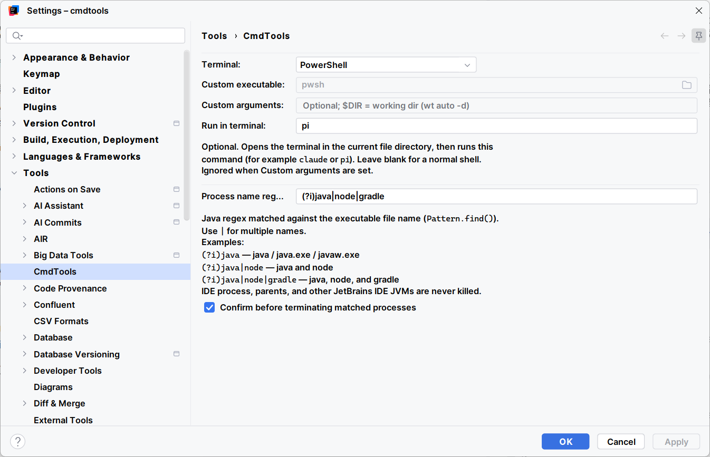

# CmdTools

Cross-platform IntelliJ Platform plugin:

- Open a system terminal in the current file’s directory (optional startup command, e.g. `claude` / `pi`)
- Reveal the current file in Explorer / Finder / file manager
- Terminate processes whose names match a regular expression (with confirmation)

**Access:** leftmost of the main toolbar center, **Tools > CmdTools**, editor/project view context menu, or Find Action.

**Settings:** **Settings > Tools > CmdTools**

Process regex examples: `(?i)java`, `(?i)java|node`. The current IDE and its parent processes, and other JetBrains IDE JVMs, are never terminated.

## Screenshots

Toolbar actions:

Settings page:

## Compatibility

- OS: Windows / macOS / Linux
- IDE: IntelliJ Platform **2024.2+** (`since-build=242`, no `until-build`)
- Dependency: `com.intellij.modules.platform` only

Works on IntelliJ Platform products such as IntelliJ IDEA, PyCharm, GoLand, WebStorm, CLion, PhpStorm, Rider, DataGrip, RubyMine, Android Studio, and similar. Fleet, Toolbox, and the Gateway client itself are not that kind of IDE and cannot install this plugin.

Newer IDE versions usually work without a plugin bump. If JetBrains changes the toolbar/API, behavior may break until a new release is verified with Plugin Verifier.

## Build

JDK 21+: `./gradlew buildPlugin` (use `gradlew.bat` on Windows). The distribution zip is under `build/distributions/`.
